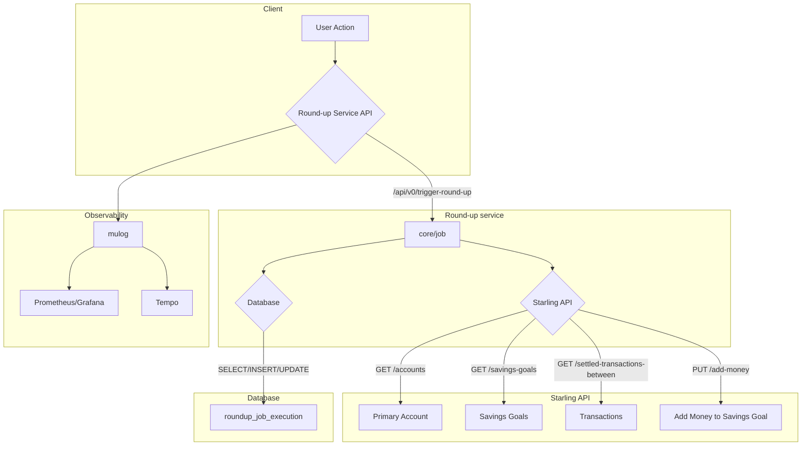
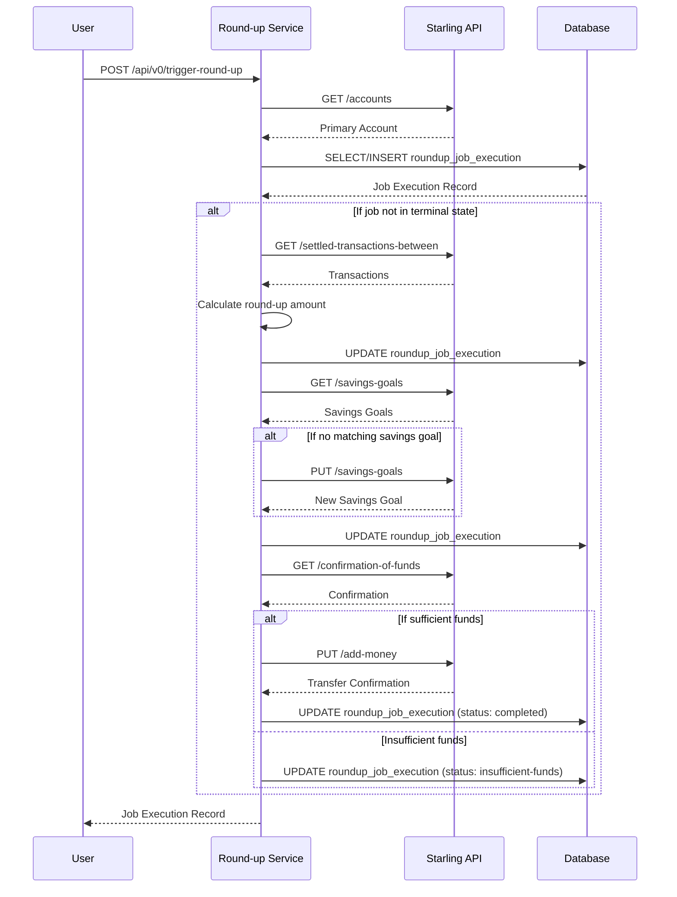

# Starling round-up service

A resilient and observable microservice, built in Clojure, that
automates weekly savings by rounding up transactions and transferring
the total to a savings goal.

## Core features

- **Automated savings** calculates the total round-up from a user's
  transactions for a given week and transfers the amount to a savings
  goal.
- **Idempotent and safe** guarantees that a round-up transfer for a
  specific account and week is processed at most once, preventing
  transactions being processed twice.
- **Resilient by design** built with automated retries and a circuit
  breaker around the dabase and the Starling API to gracefully handle
  API rate limits and temporary network failures.
- **Fully Observable** includes a pre-configured monitoring and
  tracing stack (Prometheus, Grafana, Tempo) for immediate insight
  into performance and behavior.
- **Containerized** packaged with Docker for a production-ready
  deployment that stays consistent across different environment.

<details><summary>Expand traces of the service starting</summary>


</details>

<details><summary>Expand traces for the round-up endpoint</summary>


</details>

Screeenshot of Open API UI


## 👋 Quick start for reviewers

This section provides the fastest way to get the service and its full
observability stack and dependencies up and running.

### Prerequisites

You will need **Docker** and **Docker Compose** installed on your
machine.

### Running the service

Start local services:

```zsh
docker compose up
```

This command downloads the necessary images and starts the round-up
service, a PostgreSQL database, Prometheus, Grafana, and other
monitoring tools.

The following services are then available on your local machine:
- **Starling round-up service**: http://localhost:3000
- **Grafana** (dashboards): http://localhost:3001
- **Prometheus** (metrics): http://localhost:9090
- **Adminer** (database GUI): http://localhost:5431
- **PostgreSQL**: http://localhost:5432

Start this service in a Docker container:

``` zsh
touch ./log.json

docker run \
    --network service-template_default \
    -t -p 3000:3000 \
    --volume "$PWD/log.json":/app/log.json:rw \
    localhost/com.github.piotr-yuxuan.service-template:$(cat resources/starling-roundup-service.version | tr -d '\n\r') \
    --show-config \
    --db-hostname "postgres" \
    --db-migrate \
    --prometheus-push-url "http://pushgateway:9091" \
    --zipkin-url "http://tempo:9411" \
    --starling-url "https://api-sandbox.starlingbank.com/api" \
    --allow-current-week
```

Any option appended at the end of the command line above is passed
down to the uberjar. Remove the `--show-config` to get it to actully
run instead of just displaying the CLI help and exit. Enabling
`--allow-current-week` may yield partial roundup, so I would allow not
to use it, but it may help testing.

Finally, go to http://localhost:3000, and authenticate with a token
from the Starling API. This idempotent endpoint will calculate the
round-up for the specified week and transfer it to a savings goal.

### Viewing the observability stack

No extra configuration is needed. Anonymous login with admin rights is
enabled in Grafana for ease of access. You can immediately explore the
pre-configured dashboards for insight into the service's behavior.

- **Monitoring and alerting** Go http://localhost:9090 to access
  Prometheus.
- **Application traces**: Navigate to Grafana http://localhost:3001 to
  see a PostgreSQL dashboard and traces for the running service.
  Before releasing to production, dashboard for JVM metrics and other
  metrics should be added.
- **Explore the database**: Adminer, reachable on
  http://localhost:5431, is a lightweight database UI and management
  layer. You can connect to the PostgreSQL instance using these
  credentials:
  - User: user
  - Password: password
  - Database: database

## Architectural overview

### System diagram

This is a high-level view of the service and its interactions with the
Starling API and the local observability stack and dependant services
like Starling API and the database.

<details><summary>Expand</summary>



</details>

### Sequence diagram for a round-up job

<details><summary>Expand</summary>



</details>

## Technical decisions, and rationale

This section highlights the most important design choices made to
ensure the service is robust, secure, and maintainable.

### Data integrity and precise numeric types

> Monetary values are represented as `BIGINT` in PostgreSQL and `long`
> in the application, storing amounts in minor units (e.g., pence).
> This is enforced by the `NonNegInt64` schema.

To avoid the precision and rounding errors inherent in floating-point
arithmetic, which are unacceptable in financial applications. This is
a standard, robust practice for ensuring correctness. The rounding
logic itself is explicitly tested to handle various cases.

### Idempotency and state management

> Idempotency is enforced at the database layer with a `UNIQUE`
> constraint on the `account_uid`, `calendar_year`, and
> `calendar_week`. The unique `transfer_uid` for the Starling API call
> is generated by the database and the service user is prevented from
> updating it, ensuring it is immutable once created.

This database-centric approach provides the strongest guarantee
against race conditions and prevents duplicate transfers if an
operation is retried. It makes the system's state recovery simple and
reliable, which is critical for a financial service. The application
logic first attempts to find an existing job and only creates a new
one if it doesn't exist, handling the idempotency check gracefully.

### Resilience and interaction with other services

> All external API calls and database queries are wrapped with the
> `safely` library, which implements automated retries (with
> exponential backoff) and a circuit breaker.

This resilience layer makes the service robust against transient
network failures or database connection issues, which is essential for
a reliable financial process.

I intended at first to retrieve settled transactions day-by-day
instead of fetching a full week of transactions in a single API call
to reduce the pressure on memory, but it should be a planned
development if I were to put this code in production.

### Configuration and secret management

> Application configuration is defined by a `malli` schema and parsed
> from command-line arguments and environment variables using the
> `malli-cli` library. Sensitive values like API tokens are wrapped in
> a custom `Secret` type that prevents their value from being exposed
> in logs by overriding the `toString` method.

This provides a single source of truth for configuration, complete
with validation, default values, and clear help messages. The
secret-wrapping strategy is a critical security measure to prevent
accidental leakage of sensitive credentials in logs or monitoring
systems. The middleware `secret/secret-token-reveal` ensures that
secrets are only revealed at the last moment before an external API
call.

### Short-circuiting on unexpected state with exceptions

> The compatibility of the current Starling API version with the
> version used for development is tested each time the service starts,
> and an exception will be trigger on any incompatible change. The
> application is designed to follow a narrow happy path. Any
> deviation, such as an unexpected response schema from the Starling
> API or a database error, results in an exception that short-circuits
> the current operation. A central exception middleware catches these
> exceptions and translates them into descriptive HTTP error
> responses.

This approach avoids complex conditional logic for every possible
failure scenario. Instead of attempting to handle countless edge
cases, the system fails fast and predictably. This makes the core
logic cleaner, more readable, and easier to maintain, while providing
clear, structured error information to the client. Exceptions are not
used for control flow as seen in `core/job`.

### Testing strategy

> To ensure the reliability and correctness of the service, I
> implemented a comprehensive, multi-layered testing strategy.
> Alongisde the OpenAPI check and tightened API response, my goal was
> both to get a high level of certainty and validate the behavior of
> the system under realistic conditions.

-  **Unit and integration tests**: the entire codebase is covered by
   an extensive suite of tests that validate everything from
   individual functions to the interactions between different
   components. This includes testing the core business logic
   (`core_test.clj`), the API layer (`api_test.clj`), and utility
   functions (`math_test.clj`, `secret_test.clj`).

-  **Database integration testing with Testcontainers**: all database
   interactions are tested against a real, ephemeral PostgreSQL
   database instance. The `db_test.clj` test suite uses
   `testcontainers` to spin up a fresh database for each test run.
   This ensures that the SQL queries are correct and that the database
   schema (including constraints for idempotency) behaves exactly as
   it would in production, without the flakiness of mocks.

-  **Generative testing**: I used a bit of generative testing with
   `malli.generator`. I learned from experience that this approach is
   highly effective at uncovering edge cases that might be missed by
   example-based tests alone.

-  **API contract validation**: The interactions with the Starling API
   are tested to ensure that the requests and responses conform to the
   expected schemas. This prevents bugs that could arise from
   unexpected API changes or misunderstandings of the API contract.

This guarantees that each component of the service is not only
functionally correct on its own, but that the system as a whole is
robust, reliable, and ready for production.

``` zsh
$ bin/kaocha --plugin cloverage

|---------------------------------------------------+---------+---------|
|                                         Namespace | % Forms | % Lines |
|---------------------------------------------------+---------+---------|
|                 piotr-yuxuan.service-template.api |    9.64 |   20.37 |
|              piotr-yuxuan.service-template.config |   49.87 |   75.00 |
|                piotr-yuxuan.service-template.core |   94.03 |   94.52 |
|                  piotr-yuxuan.service-template.db |   77.85 |   96.77 |
|           piotr-yuxuan.service-template.exception |   19.70 |   53.33 |
|                piotr-yuxuan.service-template.http |   65.85 |   91.04 |
|              piotr-yuxuan.service-template.logger |    1.39 |   10.71 |
|                piotr-yuxuan.service-template.main |    0.99 |   11.11 |
|                piotr-yuxuan.service-template.math |   87.67 |   89.47 |
|        piotr-yuxuan.service-template.openapi-spec |   15.38 |   44.44 |
|              piotr-yuxuan.service-template.secret |   56.82 |   53.33 |
| piotr-yuxuan.service-template.starling-api.entity |  100.00 |  100.00 |
|    piotr-yuxuan.service-template.starling-api.ops |   67.80 |   90.28 |
|---------------------------------------------------+---------+---------|
|                                         ALL FILES |   55.84 |   70.87 |
|---------------------------------------------------+---------+---------|
```

### Using Clojure

> A Clojure-based implementation.

In my previous interview I was asked about personal projects. I
believe I talked about two projects I designed and implemented end to
end: [closeable-map](https://cljdoc.org/d/piotr-yuxuan/closeable-map),
a macro-heavy application state management, and
[malli-cli](https://github.com/piotr-yuxuan/malli-cli) for command
line argument parsing and configuration validation.

Since the recruiter I got in touch with confirmed that I could use any
language, I thought that I would follow up in this take-home task and
demonstrate these libraries.

### Building a light Docker image

Beyond just functionality, this service was designed with
production-readiness in mind, particularly concerning the size and
security of its Docker image.

- The `Dockerfile` uses a multi-stage build to separate the build
  environment from the final runtime environment. This ensures that
  build-time dependencies, source code, and intermediate artifacts are
  not included in the final image, significantly reducing its size.

- Instead of shipping a full JDK or a generic JRE, the build process
  uses `jlink` to create a custom, minimal Java runtime. It analyzes
  the compiled application to include only the necessary modules from
  the JDK. This significantly reduces the image size and minimizes the
  attack surface by excluding unused components.

- The final image is built `FROM scratch`, which is an empty, minimal
  base image. This is the smallest possible starting point for a
  container, containing no operating system, libraries, or shells.

-  On static linking: I'm in no way an expert on this matter, but
   because the `scratch` image is empty, I discovered that a dynamic
   linked (`ld-musl-x86_64.so.1` from the Alpine builder) and a
   required shared library (`libjli.so`) need to be copied into the
   final image.

By employing these techniques, the final Docker image is optimized to
be as small and secure as possible, making it faster fast to deploy
and harder to exploit.

``` zsh
$ docker image ls ghcr.io/piotr-yuxuan/starling-roundup-service --format "table {{.Repository}}\t{{.Tag}}\t{{.Size}}"

REPOSITORY                                      TAG       SIZE
ghcr.io/piotr-yuxuan/starling-roundup-service   1.0.0     106MB
```


## Getting starting locally

Prerequisites:
* Docker is used to run the local development stack, including the
  database and monitoring tools.
* The `clojure` command-line tool is required to open a REPL, build
  the uberjar, and run tests.
* This repository is stored on GitHub, so `git` is expected.

### Running tests

You can execute the entire test suite, including the database
integration tests, with a single command. The project uses `kaocha` as
its test runner.

To reload tests on every changes:

```zsh
$ bin/kaocha --watch

[(..................................)(.........................)(................................................................................................................................................................................................................................................................)(.....................)(.)(................)(.......)(........)]
26 tests, 367 assertions, 0 failures.
```

In order to ignore the slower tests using testcontainers, add:
`--skip-meta :test-containers`.

## Notes on the Starling API

It is very pleasing to see such a complete, robust, and consistent API
that conforms to idiomatic REST style! Cognisant that this is a
take-home assigment part of an interview process, I shall note a
couple of observations that I'd be glad to fix on day 1 if allowed to
:)

- There is a small typo in the documentation for the `GET
  /api/v2/feed/account/{accountUid}/round-up` endpoint: « Returns *the
  the* round-up goal ».
- The `Currency` entity is defined as a string in `CurrencyAndAmount`
  but as an enum in the `Account` entity.
- There is no apparent mechanism for server-side paging of
  transactions. Native paging would be a beneficial addition for
  handling large transaction volumes.
- This API is a solid level two in the [Richardson's maturity
  model](https://restfulapi.net/richardson-maturity-model/) ranging
  from zero to three. However, HATEOAS are missing. Adding them would
  make the API more self-discoverable for clients by advertising the
  possible actions that can be taken from a given resource.
